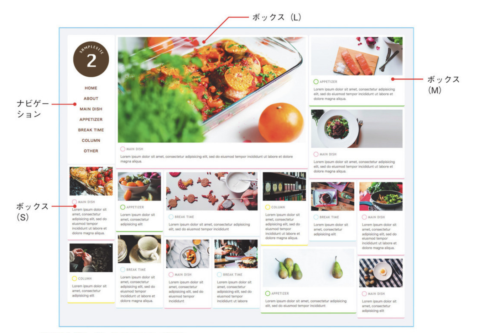

# Grid Layout Website Sample

## 特徴

多数のボックスから構成されるグリッドレイアウトは、独立した複数の情報を並列して扱うことに向いている。  
複数の情報をグリッドに沿って規則的に並べることで掲載の仕方によるバイアスがかからず、閲覧者が本当に興味をもった情報にアクセスさせることができるので、ネットショップやレシピサイトなどに適している。  
画面いっぱいに複数の写真を広げられるので、ファーストインパクトが華やかになることもメリットの一つ。  
ボックスによって異なる優先度や重要度を表現したい場合は、ボックスの大きさを変えることで自然に表現できる。

## サイト構成

- ナビゲーション
- ボックス（S）
- ボックス（M）
- ボックス（L）



## 参照

[HTML5/CSSモダンコーディング フロントエンドエンジニアが教える３つの本格レイアウト](https://www.amazon.co.jp/gp/product/B0176GNY26/ref=ppx_yo_dt_b_d_asin_title_o03?ie=UTF8&psc=1)
